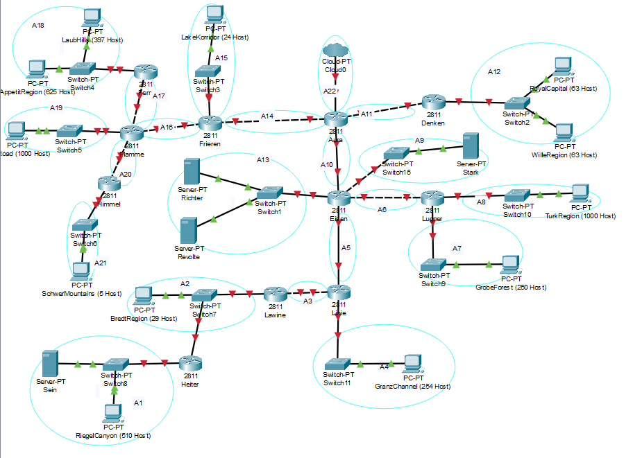
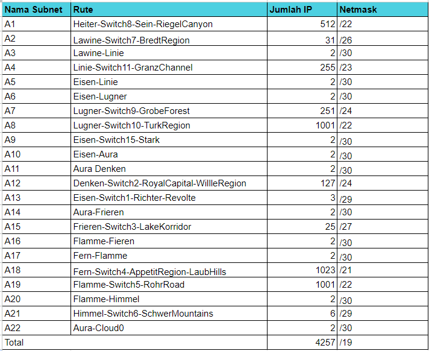
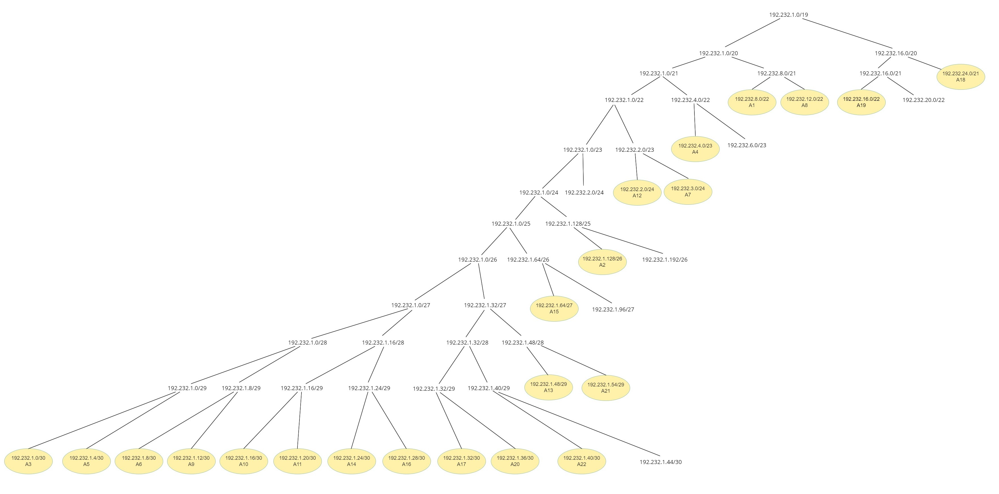

# Jarkom-Modul-4-I08-2023

Nama Anggota | NRP
------------------- | --------------		
Mardhatillah Shevy Ananti | 5025211070
Kirana Alivia Enrico | 5025211190

## CISCO VLSM Topology

## GNS CIDR Topology

## Prefix IP
Our group has the prefix IP of `192.232`

## Route

## VLSM
VLSM, or Variable Length Subnet Masking, stands as a technique in subnetting designed to optimize IP address allocation within a network. It adjusts the subnet mask size according to the specific number of computers or hosts needing IP addresses in each subnet. By breaking down a larger network into smaller subnets of varying sizes and assigning netmasks based on host requirements, VLSM offers flexibility to network administrators. 

# VLSM Tree
The following is the outcome of subdividing the larger subnet into smaller networks.

# VLSM IP Allocation 
Here are the results of the IP address allocation we obtained from the subnetting process, breaking down the network into smaller subnets.

